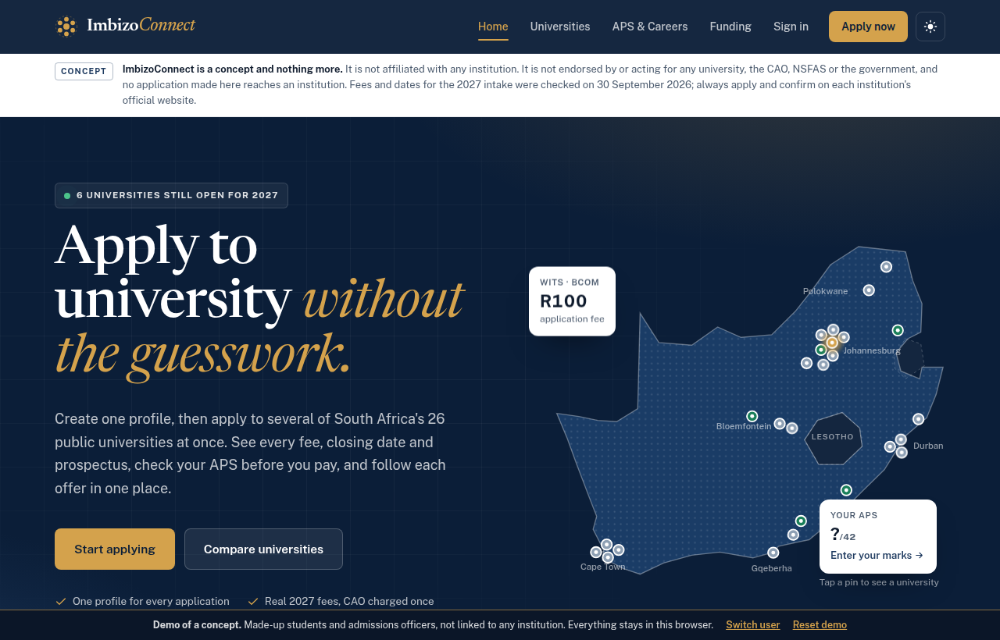
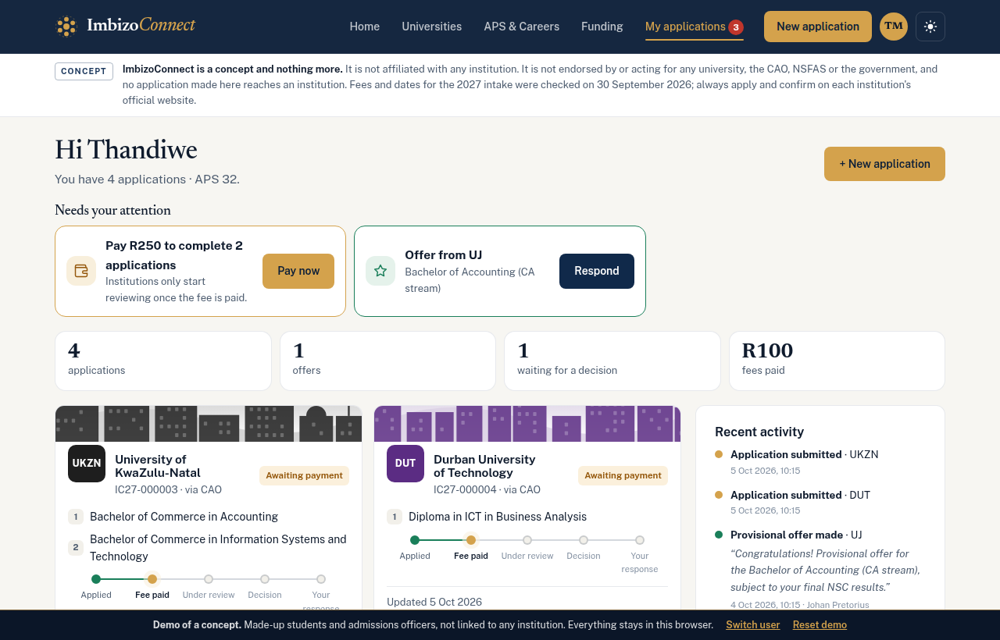
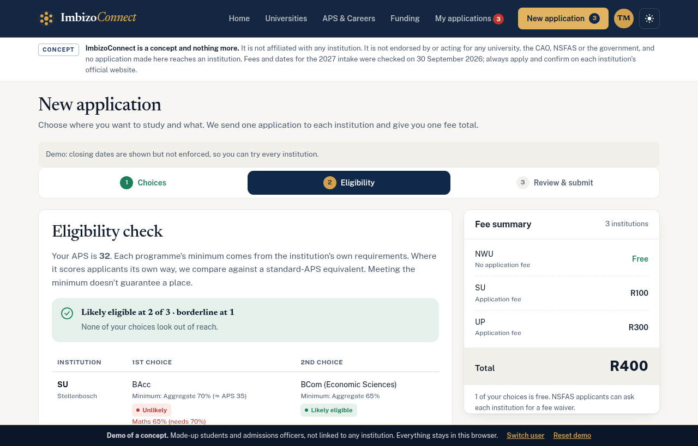
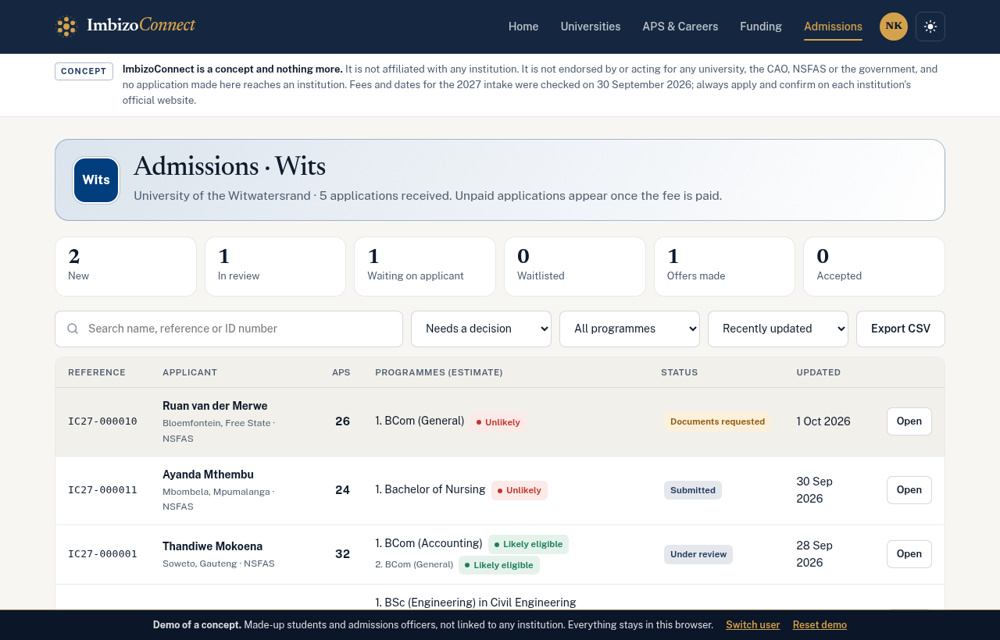
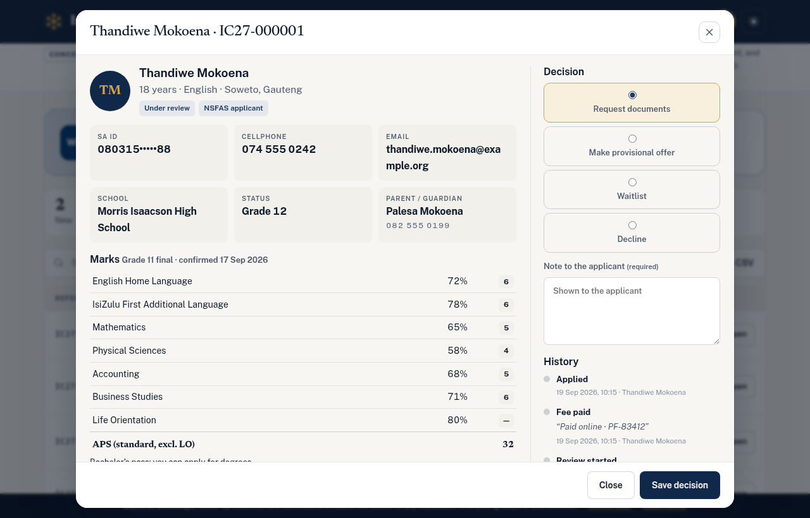
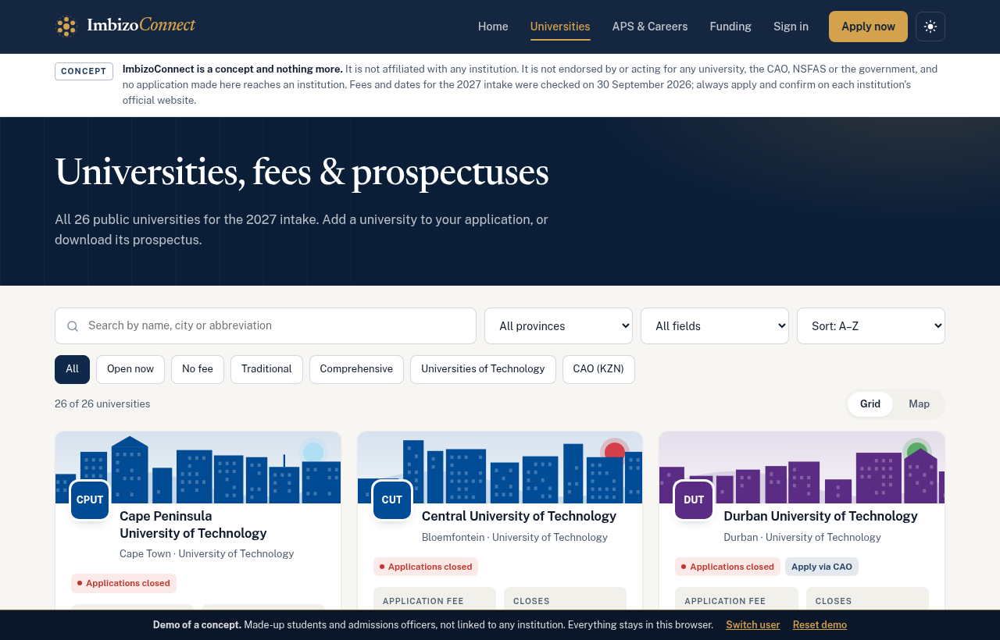
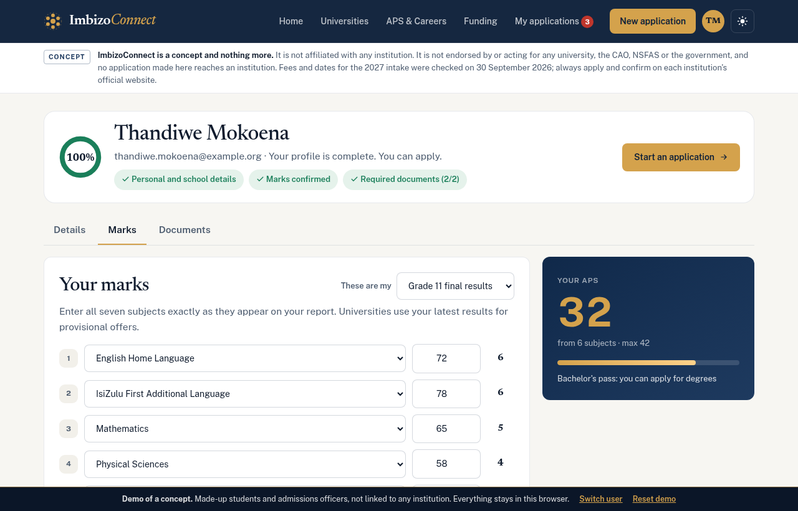
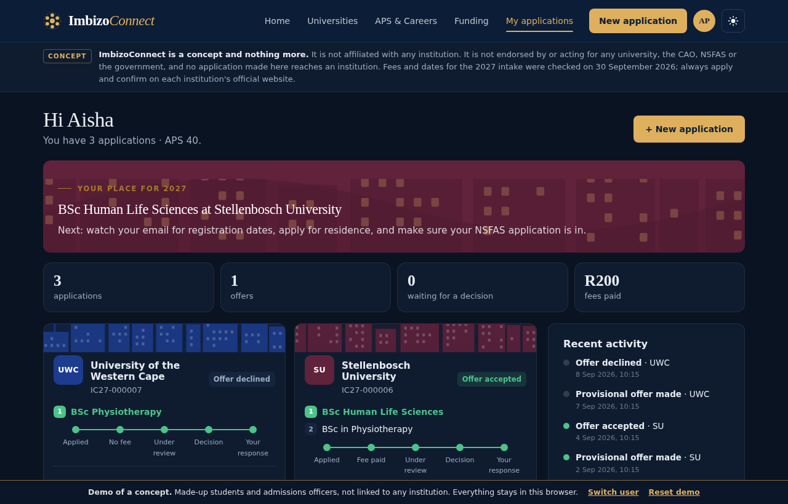
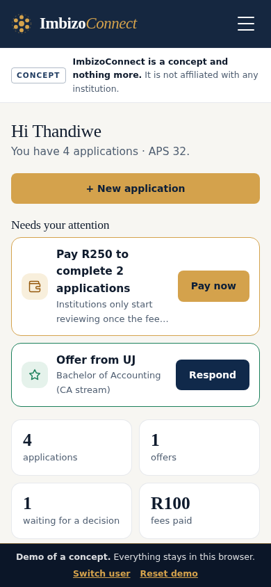

# ImbizoConnect

**Apply to several South African universities at once: one profile, one fee total, every offer in one place.**

> **ImbizoConnect is a concept and nothing more.** It is an independent portfolio project. It is not affiliated with, endorsed by or acting for any university, the CAO, NSFAS or any government department, and it does not send applications to any institution. Apply and confirm fees and dates on each institution's official website.

**[▶ Try the live demo](https://mduduzigwija.github.io/ImbizoConnect/demo/)** (made-up students and admissions officers, runs in your browser, nothing is shared)

> © 2026 Mduduzi Gwija. All rights reserved. This is proprietary software: it may not be copied, used, modified or distributed without written permission. See [LICENSE](LICENSE).



*Imbizo* is a gathering. ImbizoConnect gathers every public university's fees, closing dates and prospectuses in one place, then lets a student apply to several of them with a single profile.

### How it started

In 2015, two high school friends, **Mduduzi Gwija** and **Karabo Kennedy Mafaralala**, kept asking the same question: why does applying to university mean filling in the same forms again and again, paying a fee at every institution, and guessing whether your marks are good enough? That conversation became an idea, and the idea stayed. In 2026, Mduduzi Gwija conceptualised and built ImbizoConnect as a working platform, with thanks to Karabo for the conversations that started it.

## Highlights

- **One profile, many applications.** Students enter their details, marks and documents once. Every institution they apply to receives the same profile.
- **Real 2027 data for all 26 public universities.** Application fees, closing dates with live countdowns, faculties, how each one scores applicants, and links to official prospectuses. Five prospectus PDFs are stored in the repository. Where sources disagree on a fee, the site says so.
- **Each institution's real programmes.** 756 undergraduate programmes across the 26 institutions, each with the institution's own name, minimum (APS, or the institution's own score such as Wits APS, UCT FPS, the Mandela Applicant Score or UWC points) and subject requirements. Institutions offer different things: only UP trains vets, UP has no pharmacy school, UCT has no undergraduate BEd, and universities of technology mostly offer diplomas and BEngTech degrees. UP, SU, Rhodes, UL and WSU come from their 2027 prospectuses; the others were compiled from institution websites and 2027 guides, and the site says which.
- **Real faculties.** Every programme sits under its institution's own faculty, college or school, taken from the 2027 prospectuses (UP, SU, Rhodes, UL, WSU) and each university's official faculty pages. At UWC, for example, the BAdmin is in Economic and Management Sciences.
- **Alerts when applications open.** Closed institutions say so plainly, and anyone can leave an email address or WhatsApp number to hear when each one opens for the next intake. Admins see the requests; sending them is left to a real deployment.
- **Checks before you pay.** The APS calculator (standard 7-point scale, Life Orientation excluded) works out the NSC pass type, then estimates eligibility for each programme at each institution. Estimates appear only after the student confirms their own marks, and long shots can be dropped with one click to save their fees.
- **The CAO handled properly.** UKZN, DUT, MUT and UNIZULU share one R250 CAO fee and a limit of six programme choices. The fee is charged once, and paying it pays every CAO application.
- **An admissions portal for institutions.** Admissions officers see only their own institution's applications, and only once the fee is paid. They open the applicant's marks, documents and history, then request documents, make a provisional offer, waitlist or decline, and export the list to CSV.
- **Permissions enforced by the database.** Row-level security and workflow functions in `supabase/schema.sql` decide who sees what and which status changes are allowed, not the web page. They are covered by tests on a real PostgreSQL database.
- **Designed for the subject.** An editorial type system (Newsreader with Public Sans), an institutional navy and ochre palette, a custom SVG icon set (no emoji), each university's campus skyline in its own brand colours, an interactive map, Ndebele-inspired pattern bands, light and dark mode, and a layout that works on a phone.

| Student dashboard | Choosing and checking |
| --- | --- |
|  |  |
| **Admissions queue** | **Reviewing an applicant** |
|  |  |
| **Universities** | **Profile: marks** |
|  |  |
| **Dark mode** | **On a phone** |
|  |  |

**Built with:** plain JavaScript (ES modules, no framework or build step), HTML and CSS. Data lives in [Supabase](https://supabase.com): PostgreSQL with row-level security, authentication and private file storage. GitHub Actions and GitHub Pages run the tests and host the site. Tested with Node's test runner, Playwright browser runs and a local PostgreSQL copy of the database.

## What it does

| Who | What they can do |
| --- | --- |
| **Anyone** | Compare all 26 universities in a grid, on a map or in a fee table: fees, closing dates, faculties, websites and prospectuses. Calculate their APS and see which careers they qualify for. Shortlist institutions. Read the funding guide (NSFAS, Funza Lushaka, ISFAP) and FAQ. |
| **Student** | Build a profile with an SA ID number check (date of birth and check digit), address, guardian and school details. Enter and confirm seven subjects' marks, and upload documents (ID, results, proof of residence, photo, income proof). Choose up to 8 institutions with two programmes each and check eligibility. Submit them all at once after a declaration and POPIA consent. Pay one total (the demo simulates payment; the live version records the payment reference). Follow each application on a timeline, reply to document requests, and accept or decline offers. Accepting one offer declines the others automatically. Withdraw an application. |
| **Admissions officer** | Their institution's queue with counts (new, in review, waiting on the applicant, offers, accepted). Search, filter by status or programme, and sort by APS. Open an applicant's profile, marks, eligibility estimate, documents and history. Start a review, request documents, make a provisional offer (for the first or second choice), waitlist, or decline. A note is required to request documents or decline. Export to CSV. |
| **Admin** | Everything an officer sees, for every institution. Make people admissions officers for an institution, or admins. See applications, offers, unpaid fees and officer coverage per institution. |

**Application statuses:** *Awaiting payment → Submitted → Under review* (or *Documents requested*) *→ Provisional offer / Waitlisted / Unsuccessful → Offer accepted / Offer declined*. A student can withdraw at any point before a decision. Free applications skip the payment step.

## Try it now (demo mode)

**Online:** [mduduzigwija.github.io/ImbizoConnect/demo/](https://mduduzigwija.github.io/ImbizoConnect/demo/). Every deploy also publishes this demo copy, which is not connected to any real database.

**On your computer:** with `assets/js/config.js` left empty, the app runs the same demo with made-up people, and data is stored only in your own browser.

```bash
npm start            # then open http://localhost:8080
```

Pick a person on the sign-in screen:

- **Thandiwe** (student): a CAO fee to pay, an offer from UJ to answer, and an application under review at Wits.
- **Sipho** (student): a new student who hasn't finished his profile.
- **Aisha** (student): already accepted a place at Stellenbosch.
- **Naledi** (Wits), **Johan** (UJ) and **Priya** (UKZN): admissions officers.
- **Lwazi**: the admin.

**Demo mode is not secure** (anyone can switch user) and ignores closing dates so every institution can be tried. Don't put real personal information in it.

## Going live (free)

1. **Create a Supabase project** at [supabase.com](https://supabase.com) (free plan). Pick the *Cape Town* region if it's offered.
2. **Create the database**: in Supabase open **SQL Editor → New query**, paste all of [`supabase/schema.sql`](supabase/schema.sql), then press **Run**. It creates the tables, the 26 institutions, the security rules and a private `documents` storage bucket. Running it again later is safe.
3. **Connect the app**: in Supabase open **Project Settings → API**. Copy the *Project URL* and the *anon / publishable* key into [`assets/js/config.js`](assets/js/config.js).
4. **Set the sign-in link**: in **Authentication → URL Configuration**, set the *Site URL* to your app's web address (step 5).
5. **Publish the website**: repository **Settings → Pages → Source: GitHub Actions**, then merge to `main`. The included workflow tests and publishes the site, with the demo at `/demo/`. *Free GitHub accounts can only use Pages on **public** repositories.*
6. **Sign up first**: the first account created becomes **admin**. Everyone else who signs up is a student. The admin makes admissions staff officers for their institution under **Admin**.

*Existing databases* created before programmes were institution-specific: run [`supabase/updates/001-programmes.sql`](supabase/updates/001-programmes.sql) once, then `supabase/schema.sql` again.

Each new intake: update `closes` (and `fee` if it changed) for each institution in `assets/js/data.js` and in the `institutions` table.

## Cost

| Item | Cost |
| --- | --- |
| Supabase free plan | **R0**. 500 MB database and 1 GB file storage: thousands of student profiles with their documents. |
| Website hosting | **R0** (GitHub Pages for a public repository; Cloudflare Pages or Netlify for a private one). |
| Prospectus mirror | **R0** (GitHub Actions minutes on a public repository). |

## Things to know (challenges)

1. **It's a concept, not affiliated with any institution.** Universities don't receive these applications. Each institution has its own admissions system; a real service would need an agreement with each university and the CAO, either for staff to work in the admissions portal or to connect to their systems.
2. **Payments are recorded, not processed.** The demo simulates a card payment. The live version asks the student for their payment reference, because a real payment gateway (PayFast, Peach Payments or Ozow) needs a merchant account and a way to pass each fee on to the right institution.
3. **Eligibility is an estimate.** It uses the standard APS and a typical cut-off per programme, adjusted for how selective each institution is. Wits, UCT, SU, NMU and others score applicants their own way, and each university card says so. Students should always check the prospectus.
4. **Fees and dates change every year.** They were checked in September 2026 against university websites and published guides. Entries marked *Confirm fee* had conflicting sources.
5. **POPIA (personal information).** ID numbers, marks and documents are personal information. Access is restricted in the database itself: officers see only applicants to their own institution, and only after the fee is paid. Students give consent when they sign up and again when they submit. Choose Supabase's Cape Town region to keep data in South Africa.
6. **Visit counting.** The published site counts visits anonymously with [Umami](https://umami.is) (no cookies, no personal data), added at deploy time from `tools/analytics.html`. Local copies aren't counted.
7. **Free Supabase projects pause after 7 days without activity.** Daily use keeps it awake. A paused project is restored with one click, with no data lost.
8. **Large prospectuses stay as links.** The mirror skips files over 40 MB (the UFS prospectus is 56 MB) and links to the official PDF instead.

## Project layout

```
index.html                     the page (public sections + portal container)
assets/css/styles.css          styles (light and dark)
assets/js/config.js            your Supabase URL and publishable key
assets/js/data.js              institutions, fees, dates, brand colours, programme types, careers
assets/js/programmes.js        every institution's own programmes and minimums
assets/js/logic.js             rules: APS, pass types, SA ID, eligibility, CAO fees, workflow
assets/js/art.js               logo mark, icons, campus skylines, map, pattern
assets/js/ui.js                toasts, dialogs and other helpers
assets/js/api/demo.js          demo data stored in the browser
assets/js/api/supabase.js      real backend
assets/js/pages/*.js           the screens
supabase/schema.sql            database, permissions and workflow (run once in Supabase)
prospectuses/                  mirrored prospectus PDFs + manifest.js
tools/fetch-prospectuses.mjs   downloads prospectuses (run by the Mirror prospectuses workflow)
tools/stamp-version.sh         cache-busting on deploy
tests/logic.test.js            npm test
tests/db/                      npm run test:db (needs PostgreSQL)
docs/screenshots/              README pictures
vendor/supabase.min.js         supabase-js (bundled so no CDN is needed)
```

Developers: `npm test` runs the rules tests. `PGHOST=… PGUSER=… npm run test:db` loads `supabase/schema.sql` into a throwaway PostgreSQL database and checks every permission and workflow rule as different users. `npm run prospectuses` refreshes the mirrored PDFs.

## Copyright and licence

© 2026 Mduduzi Gwija. All rights reserved. The source code, database scripts, illustrations and designs are protected by copyright (including the South African Copyright Act 98 of 1978). No licence to copy, use, modify or distribute them is granted unless agreed in writing. See [LICENSE](LICENSE). `vendor/supabase.min.js` keeps its own MIT licence. Prospectuses belong to the institutions that published them.
